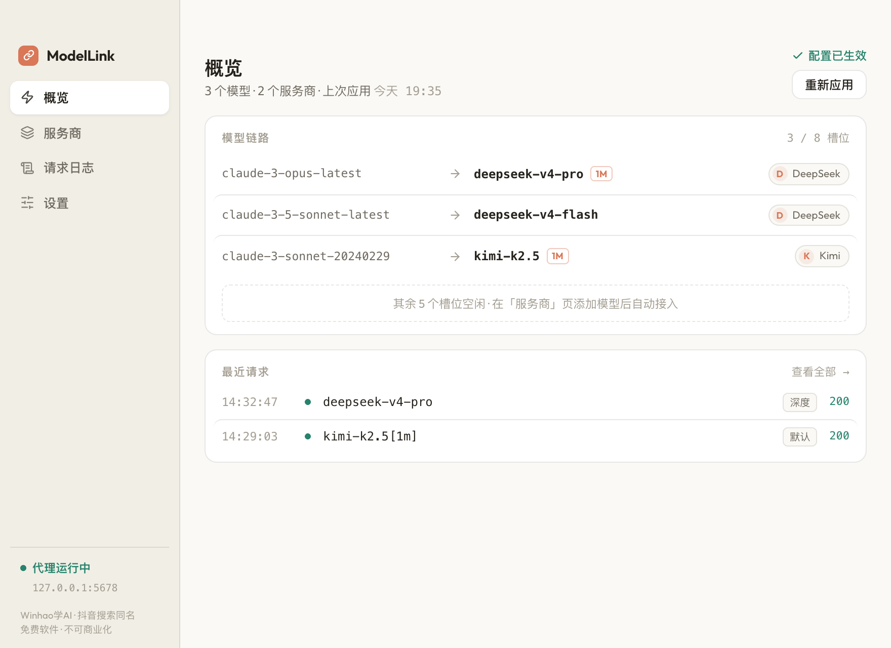
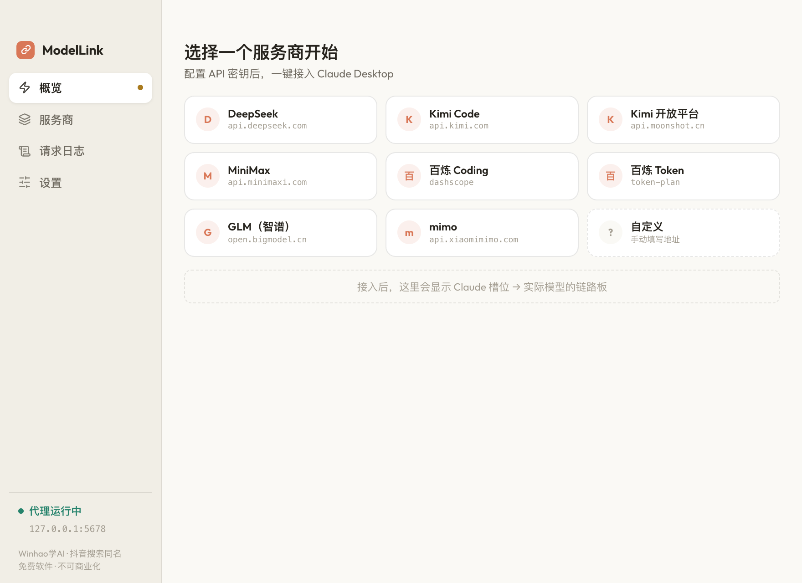
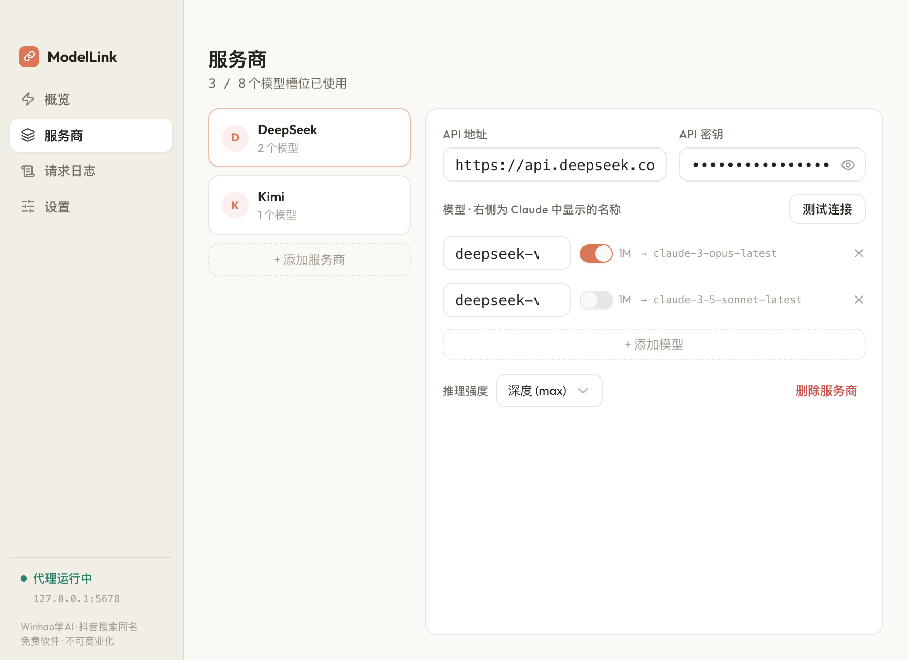

<div align="center">

# ModelLink

**让 Claude Desktop 桌面端接入任意第三方 API 模型的本地代理工具**

Kimi · MiniMax · 百炼 · 智谱 GLM · DeepSeek · mimo — 一键切换，无缝使用

[](https://creativecommons.org/licenses/by-nc-nd/4.0/)
[](#下载)
[](#免责声明与版权)

<br/>



<br/>

</div>

> **本软件完全免费，仅供个人学习和非商业用途。严禁任何形式的商业化行为，包括但不限于出售、收费分发、嵌入付费产品等。**
>
> 作者：**Winhao学AI**（抖音搜索同名，抖音号：**54927876676**）
>
> 如果你是花钱买到的这个软件，你被骗了，请举报卖家。

## 2.0 有什么新东西

2.0 是一次彻底重写（Tauri v2 + React），老用户**无感升级**——端口、配置文件、Claude 接入方式完全不变：

- **模型链路板**：Claude 槽位 → 真实模型的映射直接画出来，不用再理解「为什么 Claude 里显示的是 claude-3-opus-latest」
- **自动保存 + 应用状态提醒**：改没改、生效没生效，页头一眼看清；「应用到 Claude Desktop」仍是唯一按钮
- **应用内自动更新**：从 2.0 起新版本自动提醒、一键安装（macOS）
- **整页请求日志**：保留最近 100 条，自动刷新
- 修复 Windows 开机自启无效的问题

<div align="center">

&nbsp;&nbsp;&nbsp;&nbsp;


<sub>左：首启引导（内置 8 家服务商预设） &nbsp;|&nbsp; 右：服务商双栏编辑器</sub>
</div>

## 功能

- 将第三方模型（DeepSeek、Kimi、智谱 GLM、MiniMax、百炼、mimo 等）接入 Claude Desktop
- 支持同时配置多个 API 服务商（模型总数最多 8 个），内置主流服务商预设，也可自定义
- 支持 1M 上下文模型变体、按服务商设置推理强度
- 连接测试、请求日志、开机自启、深色/亮色/跟随系统主题
- 菜单栏/系统托盘常驻，关闭窗口后代理继续运行

## 下载

从 [Releases](../../releases) 页面下载：

| 平台 | 文件 |
|------|------|
| macOS (Apple Silicon) | `ModelLink_x.y.z_aarch64.dmg` |
| Windows | `ModelLink_x.y.z_x64-setup.exe` |

## 安装

### macOS

1. 下载 `.dmg`，双击打开，把 `ModelLink.app` 拖入「应用程序」
2. 2.0 起为正式签名 + 公证版本，直接双击打开即可

### Windows

1. 下载 `-setup.exe`，双击安装
2. 首次运行如果触发 Windows Defender 警告，选择「仍然运行」

## 首次使用

1. 打开 **ModelLink**，首页会列出内置服务商预设，点一个（或「自定义」）
2. 填写 API 密钥，点「测试连接」验证
3. 点「**应用到 Claude Desktop**」——Claude 会自动重启并接入
4. 在 Claude Desktop 的模型选择器中选择你配置的模型即可

> ModelLink 启动时会自动写入 Claude Desktop 的第三方推理配置；编辑自动保存，无需手动点保存。

### Windows 首次额外一步（仅一次）

ModelLink 会自动写入大部分配置，但首次使用需在 Claude Desktop 中手动完成一步：

1. 打开 Claude Desktop，点左上角 **☰** → **Developer** → **Configure third-party inference**
2. 切换到 **Form view**（左下角）
3. **Gateway URL** 填 `http://127.0.0.1:5678`，**API Key** 填 `proxy`
4. 点 **Apply locally**

> 之后所有模型/服务商的增删改都只在 ModelLink 里完成。

## 从 1.x 升级

直接用新安装包覆盖安装即可：

- 配置文件（`~/.claude-model-proxy/config.json`）原样沿用，服务商列表无损保留
- 代理端口（5678）与 Claude 接入方式不变，Claude Desktop 无需重新配置
- 老版本的「开机自启」会自动迁移到新机制
- 从 2.0 起支持应用内自动更新，以后不用再手动下载

## 构建

需要 Node.js ≥ 20 与 Rust 工具链：

```bash
cd gui-tauri
npm install
npm run tauri dev     # 开发
npm run tauri build   # 打包
```

发版流程（签名/公证/latest.json）见 [`gui-tauri/SIGNING.md`](gui-tauri/SIGNING.md)。
1.x 的单文件实现保留在 [`claude-model-proxy/`](claude-model-proxy/)（只读存档）。

## 免责声明与版权

- 本软件按「现状」提供，不对任何使用后果负责；API 费用由所选服务商收取，与本软件无关
- 版权所有 © Winhao学AI，采用 [CC BY-NC-ND 4.0](https://creativecommons.org/licenses/by-nc-nd/4.0/) 许可
- **完全免费，不可商业化**；二次分发请保留出处
